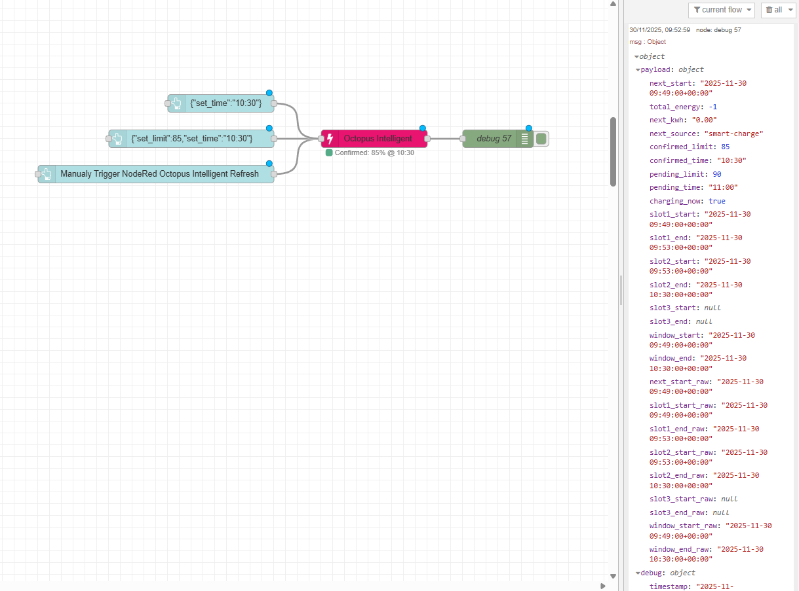
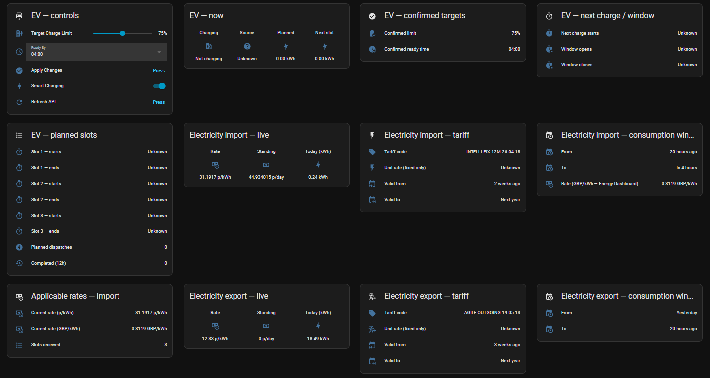
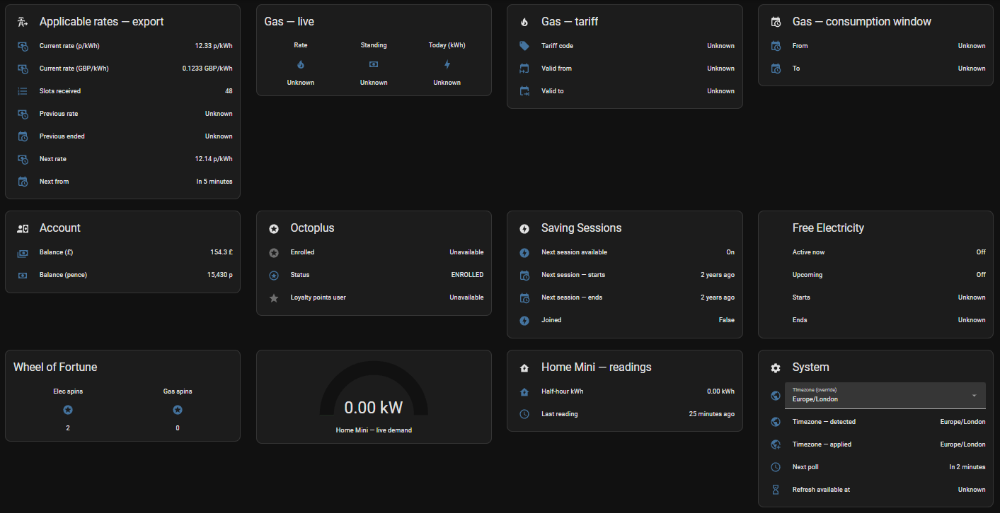
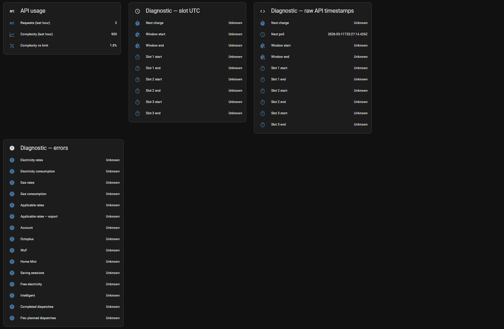
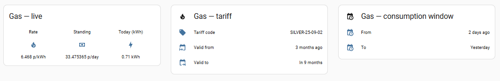

# node-red-contrib-octopus-intelligent

> Node-RED integration for **Octopus Energy** with automatic Home Assistant MQTT discovery

Monitor electricity and gas rates (import + export), EV charging schedules, real-time home energy usage, account balance, saving sessions, and Wheel of Fortune spins — all automatically configured as Home Assistant entities via MQTT discovery.

[](https://www.npmjs.com/package/node-red-contrib-octopus-intelligent)
[](https://opensource.org/licenses/MIT)

---

## 🤝 Support This Project

Found this useful? Support continued development:

<table>
<tr>
<td width="33%" align="center">

### ⭐ GitHub Star
Star the repository to show your support!

[⭐ Star on GitHub](https://github.com/ASomerN/node-red-contrib-octopus-intelligent)

</td>
<td width="33%" align="center">

### 💖 Sponsor
Support ongoing development and maintenance

[Become a Sponsor](https://github.com/sponsors/ASomerN)

</td>
<td width="33%" align="center">

### ☕ Buy Me a Coffee
If this project has helped you!

[](https://www.paypal.com/donate?hosted_button_id=A2B8ZFEJBE2S6)

</td>
</tr>
</table>

**Your support helps with:** Bug fixes and maintenance • New feature development • Documentation improvements • Community support • Feeding my children

---

## ✨ Features

### 🎮 EV Smart Controls
- **Target Charge Slider** (50–100%) — Set your desired battery level
- **Ready Time Dropdown** (04:00–11:00) — When your car needs to be ready
- **Apply Changes Button** — Prevents API spam while adjusting settings
- **Confirmed Values** — See your current API-validated settings
- **Smart Charging Toggle** — Suspend or resume Octopus intelligent charging from Node-RED or Home Assistant

### ⚡ Real-Time Charging Data
- **Next Charge Time** — When your next slot starts
- **Total Planned Energy** — Total kWh across all upcoming slots
- **Individual Slot Times** — Up to 3 slots with start/end times
- **Charging Window** — Overall window from first to last slot
- **Charge Source** — Smart-charge vs bump-charge indicator
- **Completed Dispatches** — History of completed intelligent charging sessions
- **Flex Planned Dispatches** — Upcoming flex dispatch schedule

### 🔌 Electricity & Gas Rates
- **Live Unit Rate** — Current electricity rate (p/kWh) and gas rate (p/kWh)
- **Standing Charges** — Daily standing charges for electricity and gas
- **Tariff Code** — Your current tariff identifier and validity dates
- **Recent Consumption** — Previous day kWh for electricity (import + export) and gas
- **Current Rate Slot** — Live rate from your 24h applicable rates schedule
- **Previous / Next Rate** — Adjacent slot rates and transition timestamps
- **Energy Dashboard Rate** — Electricity rate in GBP/kWh, ready for HA's Energy Dashboard cost tracking

### 🌞 Electricity Export (Solar / Battery)
- **Export Tariff** — Tariff code, standing charge, validity dates for the OUTGOING agreement
- **Export Half-Hourly Rates** — Full 48-slot schedule for variable export tariffs (e.g. Agile Outgoing)
- **Live Export Rate** — Current p/kWh and GBP/kWh
- **Previous / Next Export Rate** — Adjacent slot rates and transition timestamps
- **Export Consumption** — Previous day kWh exported to the grid (read from the export meter point)

### 🏠 Home Energy (Octopus Home Mini)
- **Live Demand** — Real-time grid import in kW
- **Period Consumption** — Energy consumed in the last half-hour period (kWh)
- Requires Octopus Home Mini device registered to your account (opt-in)

### 💰 Account & Rewards
- **Account Balance** — Current credit/debit balance in £
- **Saving Sessions** — Next session availability, start/end times, joined status, and Octopus Points
- **Free Electricity** — Upcoming free electricity window detection (active June–October)
- **Wheel of Fortune** — Remaining electricity and gas spins (opt-in)
- **Octoplus** — Enrollment status and loyalty points

### 🔧 Advanced Features
- **Account Discovery** — Automatic product detection at startup; categories auto-enable based on registered products
- **Per-Category Polling** — Each data category polls on its own configurable interval
- **Manual Refresh Button** — Force API refresh from Home Assistant (30s cooldown)
- **Next Poll Timer** — See when the next automatic refresh will occur
- **API Usage Tracking** — Monitor requests and complexity in diagnostics
- **Exponential Backoff** — Smart retry prevents sensor unavailability
- **Comprehensive Debugging** — Full API call tracking in msg.debug

### 🏡 Home Assistant Integration
- **Zero Configuration** — MQTT auto-discovery sets everything up
- **Two-Tier Entity Organisation** — Main entities (controls, live rates, consumption, tariff metadata, rewards) and Diagnostics (errors, raw timestamps, API metrics, locale timestamps)
- **Suggested Area** — Auto-suggests "Energy" area
- **Reference dashboard YAML** — `examples/ha-dashboard.yaml` covers every entity in a packed sections layout, ready to paste into HA's Raw Configuration Editor

### 🌍 Timezone Support
- **Locale Timestamps** (`*_locale` fields) — always in server auto-detected timezone
- **Resolved Display Fields** — slot and window times in your configured timezone
- **HA Timezone Select** — change timezone from Home Assistant without redeploying
- **Node Config Override** — set IANA timezone directly in the node editor
- **Zero Dependencies** — native `Intl` API, no new packages

---

## 📸 Screenshots

### Node Configuration


Configure your account credentials, polling intervals, and MQTT broker in the node editor. The MQTT Broker dropdown connects directly to your Home Assistant Mosquitto instance. Per-category intervals let you tune how often each data source is polled — electricity and gas rates update hourly by default, while Home Mini polls every minute for live demand.

### Node-RED Flow Example



### Home Assistant — Dashboard

`examples/ha-dashboard.yaml` is a comprehensive Lovelace dashboard that exposes every entity the plugin publishes. Paste it into HA's Raw Configuration Editor to get the layout below. The layout uses HA's sections view and packs cards uniformly across up to 4 columns on wide screens.

#### EV controls, electricity import & export



EV target slider and ready-time dropdown at top, then live import rate / standing / today's kWh, full import tariff card, half-hourly applicable rates summary, and the same trio for export (live export rate, export tariff, export consumption, half-hourly Agile Outgoing rates).

#### Gas, account, rewards, Home Mini



Gas rate / standing / consumption + tariff. Account balance, Octoplus enrolment, Saving Sessions card, Free Electricity card, Wheel of Fortune spins, and the Home Mini live-demand gauge with current half-hour kWh.

#### Diagnostics — UTC timestamps, raw timestamps, errors



UTC-class slot/window timestamps (HA renders them as relative "n hours ago"), raw API strings for verbatim debugging, timezone + API usage rows, and a consolidated error panel covering every category.

#### Gas — live data from a real account



For accounts with a gas meter point, the gas card populates with live tariff code, unit rate (p/kWh), standing charge, daily consumption (kWh), and tariff validity dates. Above shows v1.3.0 reading correctly from a real account on Octopus standard variable gas tariff.

#### Seasonal / conditional entities — when they show "Unavailable"

| Sensor | Active period | Outside season / condition |
|---|---|---|
| Saving Session Start / End | October–March | `null` — no sessions scheduled |
| Free Electricity Start / End | typically June–October | `null` — no sessions scheduled |
| Electricity / Gas Tariff Valid To | When tariff has an end date | `null` — open-ended tariff |
| Gas entities | Only if account has a gas meter point | `null` — electricity-only accounts |
| Home Mini | Only if a Home Mini device is registered | Entity skipped if not registered |
| Electricity Export entities | Only if account has an OUTGOING agreement | Entity values null without an export tariff |
| EV planned slots / dispatches | Only when a charge is scheduled | `null` between plug-in cycles |

These are normal MQTT behaviours, not bugs. The plugin publishes the entity definitions so HA registers them; their values populate when the API returns data for that period.

---

## 📋 Requirements

- **Node-RED** v2.0+
- **Octopus Energy Account** — any electricity account works for rates/consumption/account data
  - [Intelligent Octopus Go](https://octopus.energy/intelligent/) tariff required for EV charging features
  - Octopus Home Mini device required for real-time consumption (opt-in)
  - Wheel of Fortune is opt-in and requires an active electricity agreement
- **API Key** — [Generate here](https://octopus.energy/dashboard/new/accounts/personal-details/api-access)
- **MQTT Broker** (optional, for Home Assistant integration)
- **Home Assistant** (optional, for MQTT features)

---

## 🚀 Quick Start

### 1. Install via Node-RED Palette

1. Open Node-RED → **Menu** → **Manage Palette**
2. **Install** tab → Search `node-red-contrib-octopus-intelligent`
3. Click **Install**

### 2. Get Your Credentials

**Account Number** (format: `A-XXXXXXXX`):
- Found at https://octopus.energy/dashboard/

**API Key** (format: `sk_live_...`):
- Get from https://octopus.energy/dashboard/new/accounts/personal-details/api-access
- Click "Generate API Key"

### 3. Configure the Node

1. Drag **Octopus Intelligent** into your flow
2. Double-click to configure:
   - Account Number (format: `A-XXXXXXXX`)
   - API Key (stored securely)
   - Refresh Interval (default: 5 min — controls EV charging data polling)
   - Per-category polling intervals (electricity, gas, etc.)
   - ☑ Enable Home Mini — tick if you have an Octopus Home Mini device
   - ☑ Enable Wheel of Fortune — tick to track remaining spins
   - Enable MQTT if using Home Assistant and select your MQTT broker
3. **Deploy** — account discovery runs automatically and enables categories based on your registered products

### 4. Home Assistant (Optional)

If MQTT enabled:
1. Wait ~5 seconds after deploy
2. **Settings** → **Devices & Services** → **MQTT**
3. Find "Octopus Intelligent" device
4. All entities created automatically — no YAML required

---

## ⬆️ Upgrading from v1.2.x

v1.3.0 is additive — no breaking changes. Existing flows, automations, and dashboards continue working unchanged.

**What happens on upgrade:**
- All existing entity IDs are preserved (HA's MQTT integration matches by `unique_id`, which is stable)
- All v1.2.x payload fields remain in the same positions
- ~70 new sensors appear in Home Assistant automatically after first poll — electricity import/export tariff and rates, gas tariff and consumption, Home Mini, Octoplus, saving sessions, free electricity, Wheel of Fortune, account balance, applicable rates
- New node config options (Home Mini, Wheel of Fortune) default to off
- Two existing Octoplus booleans (`octoplus_enrolled`, `octoplus_loyalty_points_user`) move from `sensor.` to `binary_sensor.` domain — a fresh install picks the right domain automatically; a clean upgrade may register both. Delete the old `sensor.` entries via Dev Tools if you want a tidy device card.

If you installed an early dev build of v1.3 and have stale entities in Home Assistant, see [Stale Entities After Early v1.3 Dev Build](#stale-entities-after-early-v13-dev-build) in the Troubleshooting section.

---

## 📊 Home Assistant Entities

**121 MQTT entities** are published under a single **Octopus Intelligent** device on a fresh install — verified against a live install. All entities are organised into two tiers: **Main** (controls, live data, tariff metadata, rewards) and **Diagnostics** (errors, raw timestamps, locale timestamps, API metrics).

If your device card shows more than 121 entities, the extras are likely leftovers from earlier installed versions or interrupted discovery. They can be deleted via Settings → Devices & Services → MQTT → Octopus Intelligent → entity → cog → "Delete from registry" without affecting current operation.

### Node-RED payload vs MQTT entities

`msg.payload` from the Node-RED node contains **~132 fields** — 11 more than the MQTT entities count. The "extra" payload fields are intentionally **not** exposed as individual HA entities; they exist for template/automation use inside Node-RED or HA Jinja:

| Category | Fields (count) | Why no MQTT entity |
|---|---|---|
| Bulk array data | `applicable_rates`, `electricity_export_rate`, `completed_dispatches`, `flex_planned_dispatches` (4) | Each is an array of 48 half-hour slots or N dispatches. Exposing each row as an MQTT entity would clutter the registry. The `_count` summary entity exists; consume the full array via templates / `apexcharts-card` for visualisation. |
| Pending controls | `pending_limit`, `pending_time` (2) | The number/select control entities (`Target Charge`, `Ready By`) render the pending value through their own `value_template`. No separate sensor entity needed. |
| Import rate adjacency | `applicable_rates_prev_pence`, `_prev_gbp`, `_prev_to`, `_next_pence`, `_next_gbp`, `_next_from` (6) | Available in `msg.payload` for templates / dashboards. Export equivalents (`electricity_export_rate_prev_*` / `_next_*`) ARE exposed as MQTT entities — the inconsistency is intentional pending v1.4 promotion. |
| Cost placeholders | `electricity_consumption_cost`, `gas_consumption_cost` (2) | Reserved for future cost-calculation feature (consumption × rate). Always `null` in v1.3. |
| Vestigial | `saving_session_points` (1) | Octopus moved loyalty points out of saving sessions into the Octoplus query. The payload field remains for backward compatibility but is always `null`; use `binary_sensor.octopus_intelligent_octopus_octoplus_loyalty_points` instead. |

**Implication for HA users:** every value you might want to display is reachable. Direct values use the MQTT entity. Adjacent-slot import rates require an MQTT template sensor reading from `applicable_rates_prev_pence` etc. (or use the Node-RED debug node to inspect the full payload).

**Why the import / export asymmetry?** Phase 2 of v1.3.0 added the full export rate ecosystem as new MQTT entities. The pre-existing import prev/next fields were added in v1.0 as payload-only and weren't promoted at the time. Promoting them is straightforward but was descoped from v1.3 to keep release scope tight; tracked for v1.4.

### Controls

Interactive entities that accept commands. **Timezone** and **Smart Charging** still carry the HA `entity_category: config` flag (they ARE user-configurable, so the category is semantically correct).

| Name | Description |
|---|---|
| Octopus Target Charge | Slider (50–100%) — set desired battery charge level; shows the pending value until applied |
| Octopus Ready Time | Dropdown (04:00–11:00) — time by which the car must be ready |
| Octopus Apply Changes | Submit pending limit/time changes to the Octopus API |
| Octopus Refresh API | Force an immediate API refresh (30-second cooldown enforced) |
| Timezone | Display timezone for all slot and window times — 15 IANA options; persists across Node-RED restarts |
| Smart Charging | Enable (unsuspend) or disable (suspend) Octopus intelligent charging |

### Binary Sensors

| Name | Description |
|---|---|
| Octopus Charging Now | `ON` while the EV is actively inside a dispatch charging slot |
| Octopus Saving Session Available | `ON` if a saving session is upcoming or joinable |
| Octopus Free Electricity Active | `ON` while a free electricity window is in progress right now |
| Octopus Free Electricity Available | `ON` if a free electricity window is scheduled in the future |
| Octopus Octoplus Enrolled | `ON` if the account is enrolled in Octoplus |
| Octopus Octoplus Loyalty Points | `ON` if the account participates in Octoplus loyalty points (boolean flag from the API) |

### Main Sensors — EV Charging

| Name | Description |
|---|---|
| Octopus Confirmed Charge Limit | API-confirmed target charge percentage — last setting accepted by Octopus |
| Octopus Confirmed Ready Time | API-confirmed ready time — last setting accepted by Octopus |
| Octopus Next Charge Time | Start time of the next planned charging slot (display timezone) |
| Octopus Total Planned Energy | Total kWh across all upcoming planned dispatch slots |
| Octopus Next Slot Energy | Energy (kWh) scheduled for the next individual slot |
| Octopus Charge Source | Source of next charge: `smart-charge` (scheduled by Octopus algorithm) or `bump-charge` (car plugged in outside schedule) |
| Octopus Slot 1 Start | Start time of planned slot 1 |
| Octopus Slot 1 End | End time of planned slot 1 |
| Octopus Slot 2 Start | Start time of planned slot 2 (`null` if fewer than 2 slots) |
| Octopus Slot 2 End | End time of planned slot 2 |
| Octopus Slot 3 Start | Start time of planned slot 3 (`null` if fewer than 3 slots) |
| Octopus Slot 3 End | End time of planned slot 3 |
| Octopus Overall Window Start | Start of the first planned slot — when the charging window opens |
| Octopus Overall Window End | End of the last planned slot — when the charging window closes |
| Octopus Completed Dispatches | Count of completed intelligent dispatch sessions on record |
| Octopus Flex Planned Dispatches | Count of upcoming flex dispatch slots |

### Main Sensors — Electricity (Import)

| Name | Description |
|---|---|
| Octopus Electricity Standing Charge | Daily electricity standing charge (p/day) from current tariff |
| Octopus Electricity Consumption | Electricity consumed in the previous day (kWh) from the import meter |
| Octopus Current Electricity Rate | Live unit rate (p/kWh) from the 24h applicable rates schedule — use this on half-hourly tariffs (e.g. Intelligent Octopus Go) instead of Electricity Unit Rate |
| Octopus Electricity Rate | Live unit rate in GBP/kWh — measurement state class, ready for the HA Energy Dashboard |
| Octopus Electricity Unit Rate | Fixed unit rate (p/kWh) — `null` on half-hourly tariffs |
| Octopus Electricity Tariff Code | Current import tariff product code |
| Octopus Electricity Tariff Valid From / Valid To | Validity window of the current import tariff (`Valid To` is `null` for open-ended tariffs) |

### Main Sensors — Electricity (Export)

| Name | Description |
|---|---|
| Octopus Electricity Export Standing Charge | Daily export standing charge (p/day) — typically `0` for Agile Outgoing |
| Octopus Electricity Export Consumption | Electricity exported to the grid in the previous day (kWh) from the export meter |
| Octopus Current Electricity Export Rate | Live export rate (p/kWh) for the current half-hour slot |
| Octopus Electricity Export Rate | Live export rate (GBP/kWh) — measurement state class |
| Octopus Electricity Export Unit Rate | Fixed unit rate — `null` on half-hourly export tariffs (e.g. Agile Outgoing) |
| Octopus Electricity Export Tariff Code | Current export tariff product code (e.g. `AGILE-OUTGOING-19-05-13`) |
| Octopus Electricity Export Tariff Valid From / Valid To | Validity window of the current export tariff |

### Main Sensors — Gas

| Name | Description |
|---|---|
| Octopus Gas Standing Charge | Daily gas standing charge (p/day) from current tariff |
| Octopus Gas Consumption | Gas consumed in the previous day (kWh) |
| Octopus Gas Unit Rate | Gas unit rate (p/kWh) |
| Octopus Gas Tariff Code | Gas product code |
| Octopus Gas Tariff Valid From / Valid To | Validity window of the current gas tariff |

### Main Sensors — Account & Rewards

| Name | Description |
|---|---|
| Octopus Account Balance | Current account credit or debit balance (£) |
| Octopus Saving Session Joined | Whether you have joined the current saving session campaign |
| Octopus WoF Electricity Spins | Wheel of Fortune electricity spins remaining (opt-in) |
| Octopus WoF Gas Spins | Wheel of Fortune gas spins remaining (opt-in) |

### Main Sensors — Home Mini

| Name | Description |
|---|---|
| Octopus Home Mini Demand | Real-time grid import in kW — requires Octopus Home Mini and opt-in checkbox in node config |
| Octopus Home Mini Period Consumption | Energy consumed in the current half-hour period (kWh) |

### Main Sensors — Account, Octoplus, Rewards (continued)

The following appear in the main device entity list (not the Diagnostics tab):

| Name | Description |
|---|---|
| Octopus Octoplus Status | Octoplus enrollment status string (e.g. `ENROLLED`) |
| Octopus Saving Session Start / End | Start and end of the next saving session (`null` outside October–March) |
| Octopus Free Electricity Start / End | Start and end of the next free electricity window (`null` outside the active period) |

### Diagnostic Sensors

Appears under the **Diagnostics** tab of the HA device card.

#### Polling & Refresh

| Name | Description |
|---|---|
| Octopus Next Poll Time | Timestamp of the next scheduled automatic API refresh |
| Octopus Refresh Available At | Timestamp when the manual refresh cooldown expires (`null` = available now) |

#### API Usage

| Name | Description |
|---|---|
| Octopus API Requests (Last Hour) | Number of API calls made in the last 60 minutes |
| Octopus API Complexity (Last Hour) | Total estimated GraphQL complexity used in the last hour |
| Octopus API Complexity Usage | Percentage of the 50,000/hour GraphQL complexity limit consumed |

#### Raw Timestamps (UTC)

Exact UTC strings from the API, unaffected by timezone settings. Use these when you need unambiguous UTC values in automations.

| Name | Description |
|---|---|
| Octopus Next Charge Time (Raw) | Next charge time — exact UTC string from API |
| Octopus Next Poll Time (Raw) | Next poll time — exact UTC string |
| Octopus Slot 1 Start (Raw) | Slot 1 start — exact UTC from API |
| Octopus Slot 1 End (Raw) | Slot 1 end — exact UTC from API |
| Octopus Slot 2 Start (Raw) | Slot 2 start — exact UTC from API |
| Octopus Slot 2 End (Raw) | Slot 2 end — exact UTC from API |
| Octopus Slot 3 Start (Raw) | Slot 3 start — exact UTC from API |
| Octopus Slot 3 End (Raw) | Slot 3 end — exact UTC from API |
| Octopus Overall Window Start (Raw) | Window start — exact UTC from API |
| Octopus Overall Window End (Raw) | Window end — exact UTC from API |

#### Server-Timezone Timestamps (Locale)

Times in the Node-RED server's auto-detected timezone. Unlike display fields, these are never affected by the Timezone selector or `set_timezone` command.

| Name | Description |
|---|---|
| Octopus Next Charge Time (Locale) | Next charge time in Node-RED server timezone |
| Octopus Slot 1 Start (Locale) | Slot 1 start in server timezone |
| Octopus Slot 1 End (Locale) | Slot 1 end in server timezone |
| Octopus Slot 2 Start (Locale) | Slot 2 start in server timezone |
| Octopus Slot 2 End (Locale) | Slot 2 end in server timezone |
| Octopus Slot 3 Start (Locale) | Slot 3 start in server timezone |
| Octopus Slot 3 End (Locale) | Slot 3 end in server timezone |
| Octopus Overall Window Start (Locale) | Window start in server timezone |
| Octopus Overall Window End (Locale) | Window end in server timezone |
| Octopus Timezone Detected | IANA timezone auto-detected from the Node-RED server (e.g. `Europe/London`) |
| Octopus Timezone Applied | Active timezone currently used for all display timestamp fields |

#### Consumption Metadata

| Name | Description |
|---|---|
| Octopus Electricity Consumption From | Start of the electricity (import) consumption measurement period |
| Octopus Electricity Consumption To | End of the electricity (import) consumption measurement period |
| Octopus Electricity Export Consumption From | Start of the export consumption measurement period |
| Octopus Electricity Export Consumption To | End of the export consumption measurement period |
| Octopus Gas Consumption From | Start of the gas consumption measurement period |
| Octopus Gas Consumption To | End of the gas consumption measurement period |

#### Applicable Rates — Import + Export

| Name | Description |
|---|---|
| Octopus Applicable Rates Slots | Number of import rate slots in the current 24-hour window |
| Octopus Electricity Export Rate Slots | Number of export rate slots in the current 24-hour window |
| Octopus Electricity Export Rate Prev | Previous half-hour export rate (p/kWh) |
| Octopus Electricity Export Rate Prev Ends | Timestamp when the previous export slot ended |
| Octopus Electricity Export Rate Next | Next half-hour export rate (p/kWh) |
| Octopus Electricity Export Rate Next From | Timestamp when the next export slot begins |

#### Error & Detail Sensors

`null` = healthy. Non-null = the last error message from that API category.

| Name | Description |
|---|---|
| Octopus Electricity Rates Error | Last error fetching electricity rates |
| Octopus Electricity Consumption Error | Last error fetching electricity consumption |
| Octopus Gas Rates Error | Last error fetching gas rates |
| Octopus Gas Consumption Error | Last error fetching gas consumption |
| Octopus Applicable Rates Error | Last error fetching the import applicable rates schedule |
| Octopus Electricity Export Rate Error | Last error fetching the export applicable rates schedule |
| Octopus Account Balance (Pence) | Account balance in pence (raw integer) |
| Octopus Account Error | Last error fetching account data |
| Octopus Octoplus Error | Last error fetching Octoplus data |
| Octopus WoF Electricity Max | Maximum Wheel of Fortune electricity spins allowed per period |
| Octopus WoF Electricity Used | Wheel of Fortune electricity spins used this period |
| Octopus WoF Gas Max | Maximum Wheel of Fortune gas spins allowed per period |
| Octopus WoF Gas Used | Wheel of Fortune gas spins used this period |
| Octopus WoF Error | Last error fetching Wheel of Fortune data |
| Octopus Home Mini Reading Time | Timestamp of the most recent Home Mini telemetry reading |
| Octopus Home Mini Error | Last error fetching Home Mini data |
| Octopus Saving Sessions Error | Last error fetching saving sessions data |
| Octopus Free Electricity Error | Last error fetching free electricity data |
| Octopus Completed Dispatches Error | Last error fetching completed dispatch history |
| Octopus Flex Planned Dispatches Error | Last error fetching flex planned dispatch schedule |
| Octopus Intelligent Error | Last error from the intelligent charging (EV slots) query |

---

## 🆓 Free Electricity & Seasonal Sensors

Octopus Energy runs free electricity sessions (typically June–October) and saving sessions (typically October–March). The node polls for both and exposes binary sensors for automation use.

### Free Electricity
- **`binary_sensor.octopus_free_electricity_active`** — `ON` while a free window is in progress right now
- **`binary_sensor.octopus_free_electricity_available`** — `ON` if an upcoming free window is scheduled

Use these to automatically start charging your car or battery when electricity is free:

```yaml
automation:
  - alias: "Charge during free electricity"
    trigger:
      platform: state
      entity_id: binary_sensor.octopus_free_electricity_active
      to: "on"
    action:
      service: switch.turn_on
      target:
        entity_id: switch.battery_charger
```

### Saving Sessions
- **`binary_sensor.octopus_saving_session_available`** — `ON` if a saving session is upcoming
- **`sensor.octopus_saving_session_start`** / **`sensor.octopus_saving_session_end`** — start and end times

### Why These Sensors Are Null Outside Season

The Octopus API only returns free electricity and saving session data when those programmes are active. Outside their respective seasons the API returns an empty list (or in the case of saving sessions, the query itself is unavailable). The node handles this gracefully:

- Binary sensors remain `OFF` (not `unavailable`)
- Timestamp sensors (`saving_session_start`, `free_electricity_start`, etc.) return `null`
- In Home Assistant, `null`-valued configuration sensors may show as **unavailable** — this is normal and expected

---

## 🌍 Timezone Configuration

By default, slot and window times are converted to the **server's auto-detected timezone** (wherever Node-RED is running). Three ways to configure:

### Option 1: Node Config (static)
Set a fixed IANA timezone in the node editor:
- Open node → **Timezone** field → type `Australia/Sydney`
- Leave blank to use server auto-detect

### Option 2: Home Assistant Select (dynamic, persists across restarts)
Use the **Timezone** select entity in Home Assistant:
- Home Assistant → Octopus Intelligent device → Timezone
- Change takes effect on next poll
- Persists across Node-RED restarts

### Option 3: `set_timezone` Input Command
```javascript
msg.payload = { set_timezone: "Europe/London" };
// Send to Octopus Intelligent node input
```

### Timestamp Tiers
| Field suffix | Timezone | Configurable? |
|---|---|---|
| `*_raw` | Always UTC (exact API string) | Never |
| `*_locale` | Server auto-detected | Never (always server TZ) |
| Display fields (`slot1_start`, `window_start`, etc.) | Resolved TZ | Yes — via HA, config, or command |

### Supported Timezones (HA select)
`Europe/London`, `Europe/Berlin`, `Europe/Madrid`, `Australia/Sydney`, `Australia/Melbourne`, `Australia/Brisbane`, `Australia/Perth`, `Australia/Adelaide`, `Pacific/Auckland`, `America/New_York`, `America/Chicago`, `America/Denver`, `America/Los_Angeles`, `Asia/Tokyo`, `UTC`

Any valid IANA timezone works in the node config field or `set_timezone` command.

---

## 💡 Node-RED Usage

### Basic Monitoring

```
[Inject: Every 5 min] → [Octopus Intelligent] → [Debug]
```

### Set Preferences from Flow

```javascript
msg.payload = {
    set_limit: 85,        // 85% charge
    set_time: "07:30"     // Ready by 07:30
};
return msg;
```

### Set Timezone from Flow

```javascript
msg.payload = { set_timezone: "Australia/Sydney" };
return msg;
```

### Toggle Smart Charging from Flow

```javascript
msg.payload = { set_smart_charging: true };   // enable (unsuspend)
msg.payload = { set_smart_charging: false };  // disable (suspend)
return msg;
```

**Example: suspend charging when home battery is in use**
```
[Inject: suspend] → [Function: set_smart_charging=false] → [Octopus Intelligent]
[Inject: resume]  → [Function: set_smart_charging=true]  → [Octopus Intelligent]
```

### Output Format

```json
{
  "payload": {
    "next_start": "2026-05-03 01:30:00+01:00",
    "total_energy": 42.5,
    "next_kwh": "15.20",
    "next_source": "smart-charge",
    "confirmed_limit": 80,
    "confirmed_time": "07:00",
    "pending_limit": 80,
    "pending_time": "07:00",
    "charging_now": false,
    "smart_charging": true,
    "next_poll": "2026-05-03T10:35:00Z",
    "refresh_available_at": null,
    "api_requests_hour": 12,
    "api_complexity_hour": 3600,
    "api_complexity_percent": 7.2,
    "slot1_start": "2026-05-03 01:30:00+01:00",
    "slot1_end": "2026-05-03 05:30:00+01:00",
    "slot2_start": null,
    "slot2_end": null,
    "slot3_start": null,
    "slot3_end": null,
    "window_start": "2026-05-03 01:30:00+01:00",
    "window_end": "2026-05-03 05:30:00+01:00",
    "timezone_detected": "Europe/London",
    "timezone_applied": "Europe/London",
    "next_start_locale": "2026-05-03 01:30:00+01:00",
    "slot1_start_locale": "2026-05-03 01:30:00+01:00",
    "slot1_end_locale": "2026-05-03 05:30:00+01:00",
    "window_start_locale": "2026-05-03 01:30:00+01:00",
    "window_end_locale": "2026-05-03 05:30:00+01:00",
    "completed_dispatches_count": 3,
    "completed_dispatches_error": null,
    "flex_planned_dispatches_count": 1,
    "flex_planned_dispatches_error": null,
    "intelligent_error": null,
    "electricity_unit_rate": null,
    "electricity_standing_charge": 53.94,
    "electricity_tariff_code": "E-1R-INTELLI-VAR-22-01-01-A",
    "electricity_valid_from": "2022-01-01T00:00:00Z",
    "electricity_valid_to": null,
    "electricity_consumption_kwh": 8.4,
    "electricity_consumption_from": "2026-05-02T00:00:00Z",
    "electricity_consumption_to": "2026-05-03T00:00:00Z",
    "electricity_rates_error": null,
    "electricity_consumption_error": null,
    "applicable_rates_count": 28,
    "applicable_rates_current_pence": 10.33,
    "applicable_rates_error": null,
    "gas_unit_rate": 6.24,
    "gas_standing_charge": 31.05,
    "gas_tariff_code": "G-1R-VAR-22-11-01-A",
    "gas_valid_from": "2022-11-01T00:00:00Z",
    "gas_valid_to": null,
    "gas_consumption_kwh": 12.1,
    "gas_consumption_from": "2026-05-02T00:00:00Z",
    "gas_consumption_to": "2026-05-03T00:00:00Z",
    "gas_rates_error": null,
    "gas_consumption_error": null,
    "account_balance_pence": 10900,
    "account_balance_pounds": 109,
    "account_error": null,
    "octoplus_enrolled": true,
    "octoplus_enrollment_status": "ENROLLED",
    "octoplus_loyalty_points_user": true,
    "octoplus_error": null,
    "wheel_of_fortune_electricity_spins": 2,
    "wheel_of_fortune_electricity_max": 3,
    "wheel_of_fortune_electricity_used": 1,
    "wheel_of_fortune_gas_spins": 1,
    "wheel_of_fortune_gas_max": 1,
    "wheel_of_fortune_gas_used": 0,
    "wheel_of_fortune_error": null,
    "mini_demand_kw": 0.082,
    "mini_consumption_delta_kwh": 0.002,
    "mini_read_at": "2026-05-03T10:00:00Z",
    "home_mini_error": null,
    "saving_session_available": false,
    "saving_session_start": null,
    "saving_session_end": null,
    "saving_session_joined": false,
    "saving_session_points": null,
    "saving_sessions_error": null,
    "free_electricity_active": false,
    "free_electricity_available": false,
    "free_electricity_start": null,
    "free_electricity_end": null,
    "free_electricity_error": null
  },
  "debug": {
    "success": true,
    "step": "complete",
    "apiCalls": [
      {"name": "authentication", "tokenObtained": true},
      {"name": "intelligent", "slotsFound": 1},
      {"name": "electricity_rates", "success": true},
      {"name": "electricity_consumption", "success": true},
      {"name": "gas_rates", "success": true},
      {"name": "gas_consumption", "success": true},
      {"name": "home_mini", "success": true},
      {"name": "account", "success": true}
    ]
  }
}
```

> **Note:** `electricity_unit_rate` is `null` for half-hourly tariffs (e.g. Intelligent Octopus Go). Use `applicable_rates_current_pence` for the live rate on HH tariffs.

> **v1.3.0 additions:** The example above shows the v1.2.x payload shape for clarity. v1.3.0 adds ~14 additional fields covering electricity export (`electricity_export_unit_rate`, `electricity_export_tariff_code`, `electricity_export_consumption_kwh`, full `electricity_export_rate[]` half-hourly array with current/prev/next slot summaries) and import rate adjacency (`applicable_rates_prev_pence`, `_prev_gbp`, `_prev_to`, `_next_pence`, `_next_gbp`, `_next_from`). For the authoritative current set, inspect `msg.payload` in a Debug node after a real poll, or read `lib/payload.js` in the source.

---

## 🏡 Home Assistant Automation Examples

### Notify When Charging Starts

```yaml
automation:
  - alias: "EV Charging Starting"
    trigger:
      platform: state
      entity_id: binary_sensor.octopus_charging_now
      to: "on"
    action:
      service: notify.mobile_app
      data:
        message: "EV charging started"
```

### Charge During Free Electricity Window

```yaml
automation:
  - alias: "Start battery charge on free electricity"
    trigger:
      platform: state
      entity_id: binary_sensor.octopus_free_electricity_active
      to: "on"
    action:
      service: switch.turn_on
      target:
        entity_id: switch.battery_charger
  - alias: "Stop battery charge after free electricity"
    trigger:
      platform: state
      entity_id: binary_sensor.octopus_free_electricity_active
      to: "off"
    action:
      service: switch.turn_off
      target:
        entity_id: switch.battery_charger
```

### Run Dishwasher During Cheap Rate

```yaml
automation:
  - alias: "Dishwasher During Cheap Window"
    trigger:
      platform: time_pattern
      minutes: "/5"
    condition:
      - condition: template
        value_template: >
          
          
          
          {{ start <= now <= end }}
    action:
      service: switch.turn_on
      target:
        entity_id: switch.dishwasher
```

### Alert When Saving Session Available

```yaml
automation:
  - alias: "Saving session alert"
    trigger:
      platform: state
      entity_id: binary_sensor.octopus_saving_session_available
      to: "on"
    action:
      service: notify.mobile_app
      data:
        message: >
          Saving session available:
          {{ states('sensor.octopus_saving_session_start') }}
          to {{ states('sensor.octopus_saving_session_end') }}
```

---

## 🔍 Troubleshooting

### No Data (All Sensors Null/0)

Check `msg.debug` output in a Debug node:

- Account format must include `A-` prefix
- Invalid API key — regenerate at Octopus dashboard
- Not on a recognised Octopus tariff (EV sensors require Intelligent Octopus Go)
- Car not plugged in (no slots scheduled) — EV sensors null is normal when no charging is planned

### Authentication Failing

Check `msg.debug.apiCalls[0].errors` for details. Regenerate your API key and update the node configuration.

### Sensors Unavailable in Home Assistant

1. Verify MQTT broker is running
2. Check Node-RED can connect to MQTT broker
3. Deploy the flow to trigger discovery
4. Confirm Home Assistant MQTT integration is enabled

### electricity_unit_rate Always Null

This is expected on half-hourly tariffs like Intelligent Octopus Go. The tariff has no single unit rate — prices vary by half-hour slot. Use `applicable_rates_current_pence` for the live rate instead.

### Upgrading from v1.2.x — Sensors Look Different

v1.3.0 adds ~70 new sensors but does not rename or remove any v1.2 sensors. Existing automations and dashboards continue working unchanged. New sensors appear automatically in Home Assistant after the first poll following upgrade.

Two existing Octoplus booleans (`octoplus_enrolled` and `octoplus_loyalty_points_user`) move from the `sensor.` domain to `binary_sensor.` in v1.3 because they are boolean values and HA's sensor domain doesn't accept booleans cleanly. If you have automations referencing the old `sensor.` entity IDs, update them to the new `binary_sensor.` IDs after upgrade.

### Stale Entities After Early v1.3 Dev Build

If you installed an early v2 build before final release, some entity IDs may have changed. To clean up stale entities:

1. In HA → **Settings → Devices & Services → MQTT**
2. Find each stale entity name in Developer Tools → MQTT
3. Publish an **empty retained payload** to its config topic:
   ```
   Topic:   homeassistant/sensor/nodered_A-XXXX_<entity_id>/config
   Payload: (empty)
   Retain:  ✓
   ```
   This removes the entity from the broker — HA drops it automatically.

### Home Mini Not Showing

1. Tick **Enable Home Mini** in node config
2. Verify your Octopus account has a smart meter registered (visible in the Octopus app)
3. Check `msg.payload.home_mini_error` in a debug node for the specific error

### New Category Sensors All Null After Deploy

Account discovery runs once at startup. If it fails, check `msg.debug` for auth errors, verify your API key, and redeploy.

### Seasonal Sensors Show "Unavailable"

Saving session sensors are only populated October–March. Free electricity sensors are only populated June–October. Outside season, `null` values cause these sensors to show as unavailable in HA — this is correct behaviour, not a bug.

### Changes Not Applying

This is by design. Use the **Apply Changes** button to submit. This prevents API spam when making multiple adjustments.

---

## 🛠️ How It Works

### Startup — Account Discovery

On first deploy, the node queries the Octopus API to detect which products are registered on your account:

- **Electricity** — always enabled if an electricity agreement exists
- **Gas** — enabled if a gas agreement exists
- **Intelligent EV** — enabled if an EV device is registered (Intelligent Octopus Go)
- **Home Mini** — enabled if a smart meter device is registered AND the Home Mini checkbox is ticked
- **Wheel of Fortune / Saving Sessions / Account** — always polled if credentials are valid

Discovery sets which categories are active. No manual configuration required.

### Category Scheduler

Each data category polls on its own interval (configurable per category in the node editor). A 1-second clock-aligned scheduler checks which categories are due each tick. Categories poll independently — a slow gas API response does not delay your EV slot update.

### Authentication Flow

1. **Exchange API key** for a short-lived token
2. **Run category polls** in parallel — each category makes its own GraphQL query
3. **Merge results** into a single payload object
4. **Publish** to Node-RED output + MQTT state topic

### Exponential Backoff (preference changes)

When changing charge limit or ready time:

```
Mutation sent → Wait 15s → Validate
             ↓ Not confirmed yet?
             → Wait 30s → Validate
             ↓ Not confirmed yet?
             → Wait 60s → Validate
             ↓ Not confirmed yet?
             → Wait 120s → Final check
             ↓ Then normal interval resumes
```

This prevents sensors becoming "unavailable" during updates.

### Debug Information

Every message includes `msg.debug`:

```json
{
  "timestamp": "2026-05-03T10:30:00Z",
  "success": true,
  "step": "complete",
  "apiCalls": [
    {"name": "authentication", "tokenObtained": true},
    {"name": "intelligent", "slotsFound": 1}
  ]
}
```

---

## 📝 License

MIT License - Copyright (c) 2025 Andrew Somerharju Neale

See [LICENSE](LICENSE) file for full details.

---

## ⚠️ Disclaimer

This is an **unofficial integration** and is not affiliated with, endorsed by, or connected to Octopus Energy Ltd.

Use at your own risk. The Octopus Energy name and logo are trademarks of Octopus Energy Ltd.

---

## 🔗 Links

- **npm**: https://www.npmjs.com/package/node-red-contrib-octopus-intelligent
- **GitHub**: https://github.com/ASomerN/node-red-contrib-octopus-intelligent
- **Issues**: https://github.com/ASomerN/node-red-contrib-octopus-intelligent/issues
- **Octopus Intelligent**: https://octopus.energy/intelligent/
- **API Docs**: https://developer.octopus.energy/docs/api/

---

## 📜 Changelog

See [CHANGELOG.md](CHANGELOG.md) for detailed version history and release notes.

### v1.3.0 (2026-05-12)

Major additive release — full consumer read coverage. No breaking changes; all v1.2.x entity IDs, payload fields, and automations continue working unchanged.

**New read categories:**
- **Electricity import** — live unit rate, standing charge, tariff code + validity dates, daily consumption, half-hourly applicable rates (current / prev / next), GBP/kWh rate for Energy Dashboard
- **Electricity export** — full read parity with import: live export rate, standing charge, tariff code (e.g. `AGILE-OUTGOING-19-05-13`), validity dates, daily export consumption, half-hourly export rate slots (48 entries), prev / next slot rates and transition timestamps
- **Gas** — unit rate, standing charge, tariff code + validity, daily consumption (account-conditional)
- **Octopus Home Mini** — real-time grid demand (kW), half-hour consumption (kWh), last reading timestamp
- **Saving sessions** — upcoming session start/end, joined status (now read from `api.backend.octopus.energy`)
- **Free electricity** — upcoming/active session detection, binary sensors for automation
- **Wheel of Fortune** — electricity and gas spin counts (now using non-deprecated `wheelOfFortuneSpinsAllowed` on backend endpoint)
- **Account balance** — credit/debit in £ and pence
- **Octoplus** — enrollment status (string) + enrolled and loyalty-points-user booleans

**Bug fixes carried in alongside the additive work:**
- **Import / export meter point selection** — meter point selection now uses the `direction` field, not array position. Earlier dev builds on accounts with both import + export meters could surface export data as if it were import (live "current rate" showing the export Agile rate instead of the import tariff). Fixed before release; no stable v1.x build was affected.
- **MQTT transport** — added `User-Agent` header required by `api.backend.octopus.energy`. Without it the backend returns 403 at the edge, which surfaced as "WoF returns HTML" / saving sessions silently broken.
- **MQTT discovery for boolean sensors** — `octoplus_enrolled` and `octoplus_loyalty_points_user` were previously published to the `sensor` MQTT domain; HA's sensor handler doesn't accept raw boolean values cleanly, so the entities never registered on some installs. Now published as `binary_sensor` — registers reliably.
- **MQTT discovery for read-only info sensors** — removed `entity_category: config` from tariff codes, validity dates, etc. That category is intended for user-configurable entities; on read-only sensors HA's state handling caused them to stick at "unavailable". Moved to the main entity list.

**Backwards compatibility:** zero breaking changes. New entities appear automatically after first poll following upgrade. Existing automations continue unchanged.

### v1.2.1 (2026-04-29)
- **Deprecated API migration** — moved to current `devices` query and `setDevicePreferences` mutation

### v1.2.0 (2026-04-26)
- **Smart Charging Toggle** — suspend/resume Octopus intelligent charging from Node-RED or Home Assistant
- **HA MQTT Switch** — auto-discovered Smart Charging switch entity
- **`smart_charging` payload field** — live state in every message

### v1.0.4 (2025-12-11)
- **Manual Refresh Button** — Force API refresh via Home Assistant with 30s cooldown
- **Next Poll Timer** — See when next automatic refresh occurs
- **API Complexity Monitoring** — Track API usage against 50,000/hour limit
- **Rate Limiting** — MQTT button (30s cooldown), Node-RED input (no limit)

---

**Made with ⚡ for the Octopus Energy & Home Assistant communities**
